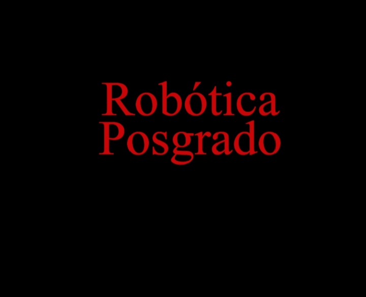

<!--  -->

<p align="center">
  
</p>

<hr>

# basic_diffbot package for ROS 2

This ROS 2 package is used to simulate a basic differential drive mobile robot in Gazebo simulator.

Author: C. Mauricio Arteaga-Escamilla from "Robotica Posgrado" Contact email: cmauricioae8@gmail.com

For more information, please refer to the following YouTube channel: https://www.youtube.com/channel/UCNmZp0rCuWxqaKVljny2zyg

## Information source
- ROS Documentation: https://docs.ros.org/en/humble/index.html


## Installing and cloning ROS 2 packages

To avoid possible errors, please update your system and install the following ROS 2 dependencies.

```bash
sudo apt-get update
sudo apt-get install ros-$ROS_DISTRO-joint-state-publisher ros-$ROS_DISTRO-xacro ros-$ROS_DISTRO-joint-state-publisher-gui ros-$ROS_DISTRO-tf2-* ros-$ROS_DISTRO-gazebo-* ros-$ROS_DISTRO-rviz-default-plugins
```

If the following error appears:<br>
_LookupError: Could not find the resource '<package_name>' of type 'packages'_

Try to install the correponding ROS dependency with

`sudo apt-get install ros-$ROS_DISTRO-<package-name>`

For example:

`sudo apt-get install ros-$ROS_DISTRO-joint-state-publisher-gui`

<br>


## Cloning and building this repo

```bash
cd ~/colcon_ws/src
git clone https://github.com/cmauricioae8/basic_diffbot.git
cd ~/colcon_ws
rosdep install -i --from-path src --rosdistro $ROS_DISTRO -y
```

If command 'rosdep' not found, use:

```
sudo apt install python3-rosdep2
```

If an error appears indicating that rosdep has not been initialized, so run:
```
rosdep update
```

If <br>
`Error(s) in package '/home/user/colcon_ws/src/basic_diffbot/package.xml':
The manifest contains invalid XML:
not well-formed (invalid token): line 31, column 43`
<br>

Please, modify the package.xml file using **your user name** and try again.


If you already have all your dependencies, the console will return:<br>
#All required rosdeps installed successfully

**Note:** _This is made only once for the whole workspace._

Then, build colcon ws:
```
colcon build --packages-select basic_diffbot --symlink-install
source install/setup.bash
```

**NOTE:** This builds the package and sets a symbolic link to the python files (nodes and launch files). With this, re-build every time that a python file is modified, is not required.<br>
In ROS 2, launch files may be written in yaml, xml or python languages, but it is extremely recommended to use python. Also, the name of all launch files must finish with 'launch.py'. Otherwise, the file will not be recognized.<br>

If some warnings appear, run `colcon build --packages-select basic_diffbot --symlink-install` again and they will disappear.


## Meshes and models setup

**IMPORTANT:**
To correctly visualize robots meshes and custom models in Gazebo with ROS 2, there are two options:

1. Add the 'GAZEBO_MODEL_PATH' environment variable into the _.bashrc_ file. This is, by pasting the followinf line
```
export GAZEBO_MODEL_PATH=~/colcon_ws/install/basic_diffbot/share/
```
If that variable already exists, use ':' to add another path. For example:
`export GAZEBO_MODEL_PATH=~/.gazebo/models:<path_to_your_model>`

or

2. Add the 'gazebo_ros' tag into the 'export' tag of the _package.xml_ file. This is
```xml
<export>
  <build_type>ament_cmake</build_type>
  <gazebo_ros gazebo_model_path = "/home/<user_name>/colcon_ws/install/basic_diffbot/share/" />
</export>
```


## Launching one robot in Gazebo

The 'one_robot_gz_launch.py' launch file, opens Gazebo using an empty or a custom world (SDF model), and spawns only one robot.

**_Note: The first time it may take a while._** You can cancel the terminal with ctrl-c and try again.

```
ros2 launch basic_diffbot one_robot_gz_launch.py
```
This will spawns a robot, using the robot model configured in the launch file, in an empty world.


## Teleoperating the robot

To teleoperate the differential mobile robot, please install 'rqt_robot_steering' debian package with:

`sudo apt install ros-humble-rqt-robot-steering*
`

and run it, with:

`rqt_robot_steering`

or

`rqt_robot_steering --force-discover`


Alternatively, to publish a velocity from terminal:

`ros2 topic pub --once /cmd_vel geometry_msgs/msg/Twist "{linear: {x: 0.1}, angular: {z: 0.3}}"`


